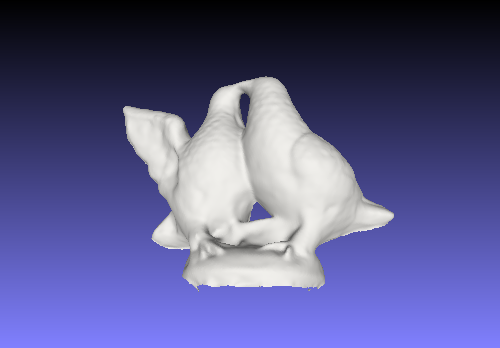
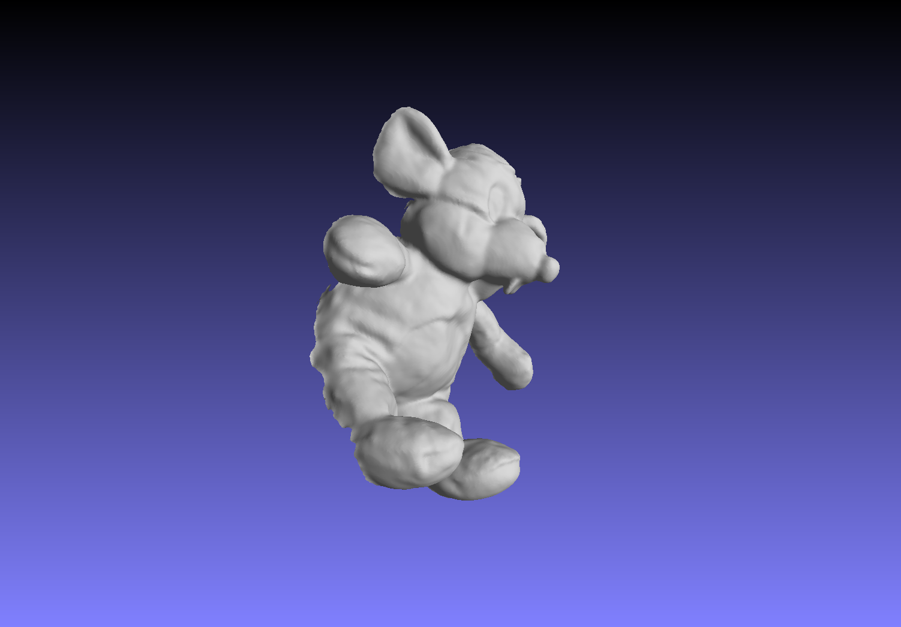

## 项目简介

本仓库是《计算机图形学》相关课程大作业，基于2024年的 3D 高斯表示方法 **Gaussian Surfels** 进行高质量表面重建与新视角合成，并结合**SIBR** 完成交互式可视化。

核心代码基于原始 Gaussian Surfels 论文作者开源实现进行实验与修改：

- Gaussian Surfels 项目主页：https://turandai.github.io/projects/gaussian_surfels/
- Gaussian Surfels 官方代码：https://github.com/turandai/gaussian_surfels
- 3D Gaussian Splatting 代码库：https://github.com/graphdeco-inria/gaussian-splatting

本项目在其基础上：

- 验证部分 DTU 场景（若干 scanXXX）以及引入 HOPE 数据集中的两个场景；
- 复现实验并探索不同训练设置下的几何与渲染效果；
- 集成 Gaussian Splatting 中的 SIBR 浏览器，对训练结果可视化；
- 对部分场景输出的点云进行 Poisson 重建和 mesh 后处理，在 MeshLab 中可视化。


## 环境与依赖

主要针对 Linux + CUDA 环境，推荐使用 Conda 进行环境管理。

根目录下提供了几份环境相关文件：

- `gaussian_surfels/environment.yml`：基于官方 Gaussian Surfels 的 Conda 环境描述；
- `gaussian_surfels_env_export.yml`：实际实验环境导出的更完整依赖列表；包含 SIBR 相关以及部分版本调整；
- `gaussian_surfels_env.tar.gz`：在实际机器上打包好的 Conda 环境压缩包。

推荐方式（基于 environment.yml 创建环境）：

```bash
conda env create -f gaussian_surfels/environment.yml
conda activate gaussian_surfels
```

如果遇到某些包版本不兼容，可以参考 `gaussian_surfels_env_export.yml` 手动调整。

如果你希望直接基于已经打包好的环境 `gaussian_surfels_env.tar.gz` 来恢复（例如在 Linux + Miniconda 环境下）：

```bash
# 假设 Miniconda 安装在 ~/miniconda3
mkdir -p ~/miniconda3/envs/gaussian_surfels
tar -xzf gaussian_surfels_env.tar.gz -C ~/miniconda3/envs/gaussian_surfels
conda activate gaussian_surfels
```
具体解压路径可以根据你自己的 Conda 安装位置调整

部分 CUDA 扩展（如 diff-gaussian-rasterization）在首次运行前可能需要重新编译安装，官方推荐做法如下（仅作参考，通常本仓库中的编译结果已经可直接使用）：

```bash
cd gaussian_surfels/submodules/diff-gaussian-rasterization
python setup.py install && pip install .
```


## 项目结构

根目录主要结构如下：

- `gaussian_surfels/`
	- Gaussian Surfels 代码及本项目的主要实验脚本；
	- `train.py`、`render.py`、`eval.py`：训练、渲染和评价入口脚本；
	- `data/`：用于实验的 DTU、HOPE 等数据（未上传）；
	- `output/`：训练输出（未上传）；
	- `submodules/`：包含 diff-gaussian-rasterization、simple-knn、omnidata 等子模块源码；
	- `README.md`：官方 Gaussian Surfels 项目的原始说明文档，包含更详细的论文与环境说明。

- `SIBR_viewers/`
	- SIBR 可视化工具；
	- `src/`、`extlibs/`、`cmake/` 等为其 C++/CUDA/图形学可视化代码；
	- `build/` 与 `install/` 目录为编译和安装产物，体积较大，未上传。

- `report/`
	- `report.tex`：报告。

- `screenshots/`
	- 使用 MeshLab 对重建 mesh 的可视化截图。

- `video/`
	- SIBR 部分视频片段。

```markdown


```

## 数据与输出说明

出于限制：

- `gaussian_surfels/data/`
	- 部分 DTU 场景（如 `scan105`、`scan106`、`scan110`、`scan114`、`scan118` 等），基于 IDR 格式
	- HOPE 数据集的两个场景（如 `hope_video/scene_0000`、`scene_0001` 及其 full 版本（包含所有帧图像）等）；

- `gaussian_surfels/output/`
	- 各 DTU/HOPE 场景训练得到的高斯点云、渲染结果、评测日志以及 Poisson 重建 mesh；
	- 包括 mesh 文件，以及用于 SIBR 浏览器展示的结果目录。

如果需要完整的数据和所有中间结果（包括 data、output、等），可以通过以下网盘链接获取：

- 完整项目及数据链接：
	- 链接：https://pan.quark.cn/s/f81a73635991
	- 提取码：KHCA

下载并解压后，将其中的 `data/`、`output/` 等目录放回到 `gaussian_surfels/` 下即可。


## 运行说明

### 1. 环境准备

```bash
git clone git@github.com:sylgha/computer-graphics-project-3DGS.git
cd computer-graphics-project-3DGS

conda env create -f gaussian_surfels/environment.yml
conda activate gaussian_surfels
```

如需复现，请从上面的网盘链接下载数据和输出，并将目录结构恢复为：

- `gaussian_surfels/data/gaussian-surfels-dtu-hf/scanXXX`
- `gaussian_surfels/data/hope_video/scene_0000` 等
- `gaussian_surfels/data/hope_video_full/scene_0000` 等


### 2. 训练示例

进入 Gaussian Surfels 目录：

```bash
cd gaussian_surfels
```

以 DTU `scan105` 为例（全视角训练）：

```bash
python train.py -s data/gaussian-surfels-dtu-hf/scan105 -m output/scan105
```

如果需要 1:1 划分 train/test（和 IDR 一致的 half split 设置）：

```bash
python train.py -s data/gaussian-surfels-dtu-hf/scan105 -m output/scan105_half --idr_half_split
```

HOPE 数据集场景示例：

```bash
# 100 帧子集（data/hope_video），全部视角训练
python train.py -s data/hope_video/scene_0000 -m output/hope_scene_0000

# 全部帧（data/hope_video_full），全部视角训练
python train.py -s data/hope_video_full/scene_0000 -m output/hope_scene_0000_full
```

更多训练命令可以参考 `gaussian_surfels/train.txt`。


### 3. 渲染与 mesh 重建

训练完成后，可通过 `render.py` 对某个模型进行渲染和几何重建：

```bash
python render.py -m output/scan114_half --img --depth 10
```
有关泊松重建的八叉树深度等参数，可以参考 `render.py` 中的说明，适当调整，深度越大通常计算时间越长。


### 4. SIBR 可视化

本项目集成了来自 3D Gaussian Splatting 的 SIBR 浏览器（高斯点云实时可视化工具）。

编译和安装流程与原始仓库基本一致，完成后可执行类似命令：

```bash
cd SIBR_viewers/install/bin
./SIBR_gaussianViewer_app -m /path/to/gaussian_surfels/output/scan114_half
```

## 引用
本课程项目大量依赖并基于以下开源项目和数据集：

- Gaussian Surfels: High-quality Surface Reconstruction using Gaussian Surfels
	- 代码与数据：https://github.com/turandai/gaussian_surfels
	- 论文与项目页：https://turandai.github.io/projects/gaussian_surfels/

- 3D Gaussian Splatting for Real-Time Radiance Field Rendering
	- 代码与 SIBR 浏览器：https://github.com/graphdeco-inria/gaussian-splatting

- IDR, Omnidata, DTU, HOPE 等相关工作与数据集，详见各自官方仓库与主页。

如在研究中使用 Gaussian Surfels，请优先引用其原始论文；本仓库仅作为课程大作业的实践记录与整理。
